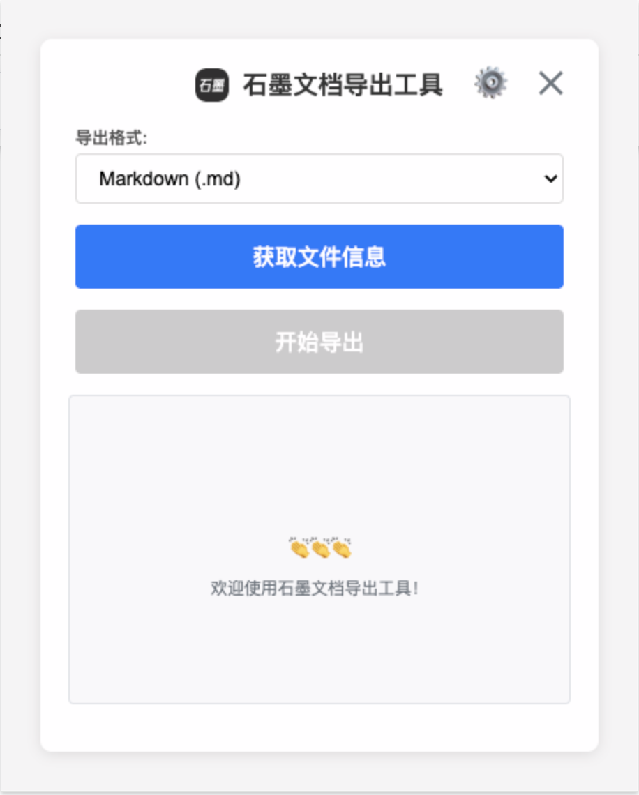
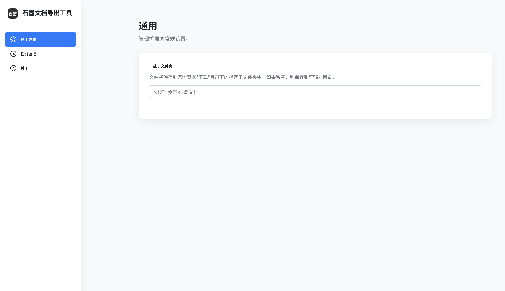
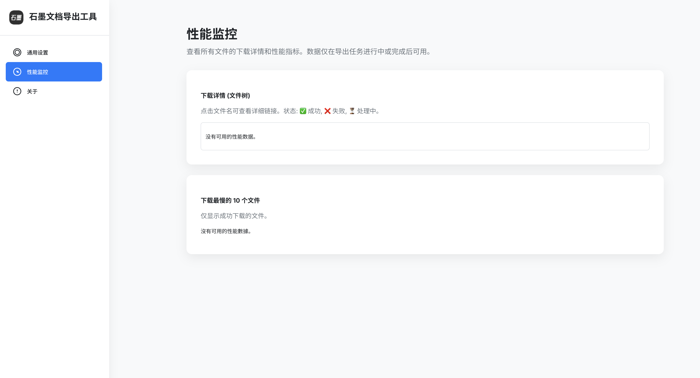

# 石墨文档导出工具 - Chrome插件

一个强大的Chrome浏览器插件，用于从石墨文档批量导出文件到本地，支持多种格式导出，完整保留原始文件夹结构。

## ✨ 功能特性

### 🚀 核心功能
- ✅ **自动认证** - 自动获取用户登录状态，无需手动复制token
- ✅ **批量导出** - 一键导出所有文件，支持递归获取子文件夹
- ✅ **多格式支持** - 支持 Markdown、PDF、Word、图片等多种格式
- ✅ **文件夹结构** - 完整保留原始的文件夹层级结构
- ✅ **智能命名** - 自动处理文件名中的特殊字符

### 🎛️ 用户体验
- ✅ **实时进度** - 显示导出进度条和详细日志
- ✅ **暂停/继续** - 支持随时暂停和恢复导出任务
- ✅ **失败重试** - 自动记录失败文件，支持单独重试
- ✅ **状态恢复** - 意外关闭后重新打开可恢复任务状态
- ✅ **性能监控** - 查看下载详情和性能指标

### 🔧 高级功能
- ✅ **自定义下载路径** - 可设置下载子文件夹
- ✅ **错误处理** - 完善的错误提示和异常处理
- ✅ **网络优化** - 智能重试和超时处理
- ✅ **内存管理** - 优化的内存使用，支持大量文件导出

## 📸 界面截图

### 主界面


### 设置页面


### 性能监控


## 🛠️ 安装方法

### 方法一：开发者模式安装（推荐）

1. **下载项目**
   ```bash
   git clone https://github.com/Navyum/shimoExporter.git
   cd shimoExporter/chrome-extension-shimo-export
   ```

2. **打开Chrome扩展页面**
   - 在地址栏输入：`chrome://extensions/`
   - 或者：菜单 → 更多工具 → 扩展程序

3. **开启开发者模式**
   - 点击右上角的"开发者模式"开关

4. **加载扩展**
   - 点击"加载已解压的扩展程序"
   - 选择项目文件夹
   - 安装完成！

### 方法二：从Chrome Web Store安装（待发布）

1. 访问Chrome Web Store
2. 搜索"石墨文档导出工具"
3. 点击"添加至Chrome"

## 📖 使用指南

### 1. 准备工作
- 确保已登录 [石墨文档](https://shimo.im)
- 确保浏览器允许下载文件

### 2. 基本使用
1. **打开插件**
   - 点击浏览器工具栏中的插件图标

2. **选择导出格式**
   - Markdown (.md) - 适合文档编辑
   - PDF (.pdf) - 适合打印和分享
   - Word (.docx) - 适合Office编辑
   - 图片 (.jpg) - 适合截图保存

3. **获取文件信息**
   - 点击"获取文件信息"按钮
   - 插件会自动扫描所有可访问的文件

4. **开始导出**
   - 点击"开始导出"按钮
   - 文件将自动下载到浏览器默认目录

### 3. 高级功能

#### 暂停和继续
- 导出过程中可随时点击"暂停导出"
- 暂停后可点击"继续导出"恢复任务

#### 失败重试
- 导出完成后会显示失败的文件列表
- 点击"重试失败的文件"可重新导出

#### 自定义设置
- 点击右上角⚙️图标打开设置页面
- 可设置下载子文件夹名称
- 查看性能监控数据

## ⚙️ 设置说明

### 通用设置
- **下载子文件夹**：设置文件保存的子文件夹名称
- **自动恢复**：意外关闭后自动恢复任务状态

### 性能监控
- **文件树视图**：查看所有文件的下载状态
- **性能指标**：显示下载最慢的文件列表
- **详细日志**：查看每个文件的处理详情

## 🔧 技术架构

### 核心技术
- **Manifest V3** - 使用最新的Chrome扩展API
- **Service Worker** - 后台任务处理
- **Chrome APIs** - cookies、storage、downloads等
- **现代JavaScript** - ES6+语法，async/await

### 文件结构
```
chrome-extension-shimo-export/
├── manifest.json          # 扩展配置文件
├── popup.html             # 弹窗界面
├── popup.css              # 弹窗样式
├── popup.js               # 弹窗逻辑
├── settings.html          # 设置页面
├── settings.css           # 设置页面样式
├── settings.js            # 设置页面逻辑
├── background.js          # 后台服务脚本
├── icons/                 # 图标资源
│   ├── icon16.png
│   ├── icon32.png
│   ├── icon48.png
│   └── icon128.png
├── README.md              # 项目说明
└── INSTALL.md             # 安装指南
```

### API集成
- **石墨文档API** - 文件列表获取、导出任务创建
- **Chrome扩展API** - 权限管理、文件下载、状态存储
- **错误处理** - 完善的异常捕获和用户提示

## 🚀 性能优化

### 内存管理
- 分批处理大量文件，避免内存溢出
- 及时清理临时数据
- 优化数据结构，减少内存占用

### 网络优化
- 智能重试机制
- 请求超时处理
- 并发控制，避免API限流

### 用户体验
- 异步处理，不阻塞UI
- 实时进度更新
- 状态持久化，支持任务恢复

## 🔒 安全说明

### 数据安全
- 所有操作在本地进行，不上传任何数据
- 使用Chrome原生API，安全可靠
- 不收集用户个人信息

### 权限说明
- `cookies` - 获取石墨文档登录状态
- `storage` - 保存设置和任务状态
- `downloads` - 下载导出文件
- `activeTab` - 获取当前标签页信息
- `scripting` - 执行脚本（已移除content script）
- `power` - 保持后台运行

## 📊 使用统计

### 支持的文件类型
- 📄 文档：支持所有石墨文档类型
- 📁 文件夹：递归处理所有子文件夹
- 🖼️ 图片：支持图片格式导出

### 性能指标
- ⚡ 单文件导出：通常 1-5 秒
- 📦 批量导出：支持数千个文件
- 💾 内存使用：优化的内存管理
- 🔄 并发处理：智能并发控制

## 🤝 贡献指南

### 开发环境
1. 克隆项目
2. 安装依赖（如果有）
3. 修改代码
4. 测试功能
5. 提交PR

### 问题反馈
- 使用GitHub Issues报告问题
- 提供详细的错误信息和复现步骤
- 包含浏览器版本和系统信息

## 📝 更新日志

### v1.0.0 (2024-01-XX)
- 🎉 初始版本发布
- ✨ 支持自动获取用户认证
- 📁 支持多种导出格式
- ⏸️ 支持暂停/继续功能
- 📊 实时进度显示
- 🔧 完善的设置页面
- 📈 性能监控功能
- 🎨 现代化UI设计
- 🚀 优化的代码架构

## 📄 许可证

本项目仅用于学习交流和个人使用，请勿用于商业用途。如存在侵权行为，请联系删除。

## 🙏 致谢

感谢石墨文档提供的API服务，以及所有为这个项目做出贡献的开发者。

---

**注意**：使用本工具时请遵守石墨文档的使用条款，仅用于合法的个人用途。 